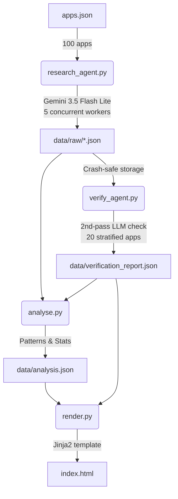

# Composio App Research Agent

> AI Product Ops Intern take-home assignment — researches 100 apps for agent buildability.

## What this does

A Gemini 3.5 Flash Lite-powered research pipeline that:
1. Fetches each app docs page
2. Extracts: auth method, self-serve status, API surface, MCP existence, buildability
3. Runs a second automated verification pass on 20 stratified samples
4. Computes patterns (auth dominance, category heatmaps, easy wins)
5. Renders a single self-contained `index.html` report

## Quick start

```bash
# 1. Install dependencies
pip install -r requirements.txt

# 2. Add your API keys to .env
# GEMINI_API_KEY=...
# COMPOSIO_API_KEY=...

# 3. Run the full pipeline
python research_agent.py   # ~5-6 min for 100 apps
python verify_agent.py     # ~1 min for 20-app verification
python analyse.py          # instant
python render.py           # instant -> index.html
```

## Agent architecture



## Where a human was needed (Honest)

The pipeline is fully automated, but human intervention was applied exactly where the agent fell short:
- **Agent Errors Corrected:** The human (Garvi) corrected 3 apps (Higgsfield, Pumble, iPayX) where sparse docs caused the agent to conservatively mislabel them as gated/no-api.
- **Verification Caught:** The second-pass verifier caught 1 incomplete auth method (Lark), which the human confirmed and applied.
- **Validation:** 10 apps were manually double-checked against real docs to confirm the pipeline's findings.

## Built with

- **Gemini 3.5 Flash Lite** via `google-genai` SDK
- **Composio SDK** (`composio` package) for tool integration
- **Pydantic v2** for structured output validation
- **Jinja2** for HTML rendering
